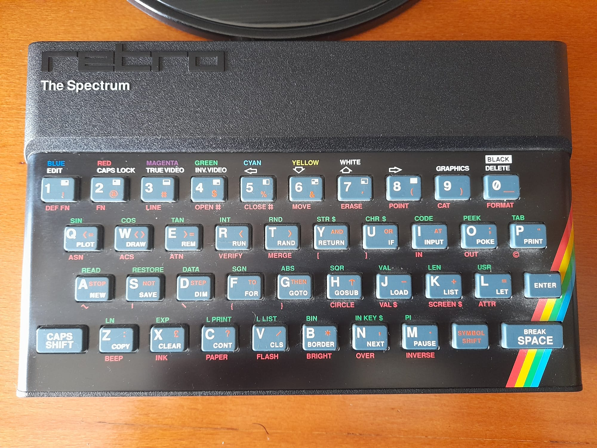

# Keyboard & Controls

The emulator uses a strict 1-to-1 physical mapping to the 40 original ZX Spectrum keys. For project organization, the **Godot Input Map** is sorted as follows: **Alphabet (A-Z)** → **Numbers (0-9)** → **Special Keys**.

### Keyboard Mapping
| PC Key | Spectrum Key | Note |
| :--- | :--- | :--- |
| **Left Shift** | `CAPS SHIFT` | Used for capitalized symbols and secondary functions. |
| **Ctrl (Control)** | `SYMBOL SHIFT` | Used for red symbols (e.g. `,`, `.`, `;`). |
| **Arrows** | `5, 6, 7, 8` | Mapped to Spectrum cursor keys. |
| **Backspace** | `0` (+ Caps Shift) | Mapped to the `DELETE` function (Shift + 0). |
| **Enter** | `ENTER` | Standard Spectrum Enter. |
| **Space** | `SPACE` | Standard Spectrum Space. |

**Common Symbols:**
*   **Comma (`,`)**: Hold `Ctrl` + `N`
*   **Period (`.`)**: Hold `Ctrl` + `M`
*   **Semicolon (`;`)**: Hold `Ctrl` + `O`
*   **Quote (`"`)**: Hold `Ctrl` + `P`

### Peripherals (Joystick & Mouse)
*   **Kempston Joystick**: Mapped to the **A** and **B** buttons on your gamepad (Action: `zx_fire`).
*   **Kempston Mouse**: The **Left Mouse Click** acts as the primary fire button.
*   **Sinclair Joystick**: Use the number keys (6-0 for Port 1, 1-5 for Port 2).

---

## Exporting for Desktop (Windows / Linux)
1. Go to **Project > Export** and add a preset (Windows Desktop or Linux/X11).
2. Ensure the correct native library is in `bin/` (`godot_zx.dll` for Win, `godot_zx.so` for Linux).
3. Set your desired **Main Scene** (Launcher or Standalone) in Project Settings.
4. Export the project. 
    *   **Tip**: Check the **"Embed Pck"** option in the export settings to bundle everything into a **single executable file**, which is much cleaner for distribution.
