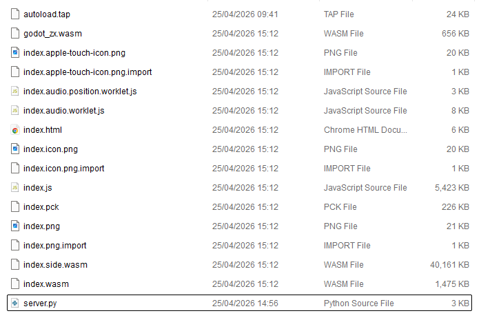
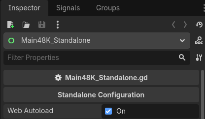
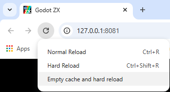

# Standalone Configuration

The Standalone version of the project is designed for distributing a single game, making it ideal for platforms like Steam or for creating a Web version that loads a specific game automatically.

## Changing the Game Path

To change which game the standalone version boots, follow these steps:

### Editor Overview

The image below shows the Godot Editor setup for the Standalone scene:


**What you see in the image:**

1.  **Scene Tree**: The `Main48K_Standalone.tscn` (or `Main128K_Standalone.tscn`) is open.
2.  **Selected Node**: The root node (**Main48K_Standalone**) is selected.
3.  **Inspector**: On the right panel, under the **Standalone Configuration** category, you find the game configuration fields.
4.  **Game Path**: Here you define the path to the local game file (e.g., `res://games/znake.tap`). **Only .tap files are supported.**

---

## Input & Control Strategy

Unlike the main emulator, the Standalone version uses a **Single, Fixed Mapping Profile** for simplicity.

1.  **Fixed Configuration**: You define the arrow key mapping (e.g., Q/A/O/P) directly in the Inspector.
2.  **No Toggle**: The Caps Lock toggle is disabled in this mode to ensure a consistent experience.

---

## Virtual Controls (Itch.io & Mobile)

The project includes a virtual **D-pad** and **Fire Button**, perfect for Web versions published on platforms like **Itch.io**.

### Action Mapping

The virtual buttons (of type `TouchScreenButton`) are linked to the following Godot Input Actions:

*   **D-pad**: Triggers `arrow_up`, `arrow_down`, `arrow_left`, and `arrow_right`.
*   **Fire Button**: Triggers `zx_fire`.

### Option: Visibility Mode (TouchScreen Only)

All virtual controls are pre-configured with the **Visibility Mode** property set to **TouchScreen Only** in the Godot Inspector.

*   **How it Works**: This native Godot feature makes the buttons invisible on computers and automatically shows them only when the game is launched on a device with a touchscreen interface.
*   **Advantage**: Ensures a clean, full-screen interface for desktop players (Steam) and a functional touch interface for web/mobile players (Itch.io).

---

## Web Autoload (Dynamic Loading)

This feature is ideal for the Web, allowing you to swap games on the server without having to export the project again.

### File Structure on the Server

As shown in the image below, for autoload to work, the game file must be in the same folder as the exported Godot files:



*   **Main File**: The game file must be named exactly **`autoload.tap`**.
*   **Location**: It must be at the root of the server, next to `index.html` and `index.pck`.
*   **Server**: The `server.py` file must be present to run the local server with the correct permissions.

### How to Enable in Godot

In the Inspector, you can toggle between local and web mode:



1.  **Enable Web Autoload**: Click the **Web Autoload** checkbox.
2.  **Automatic Effect**: As soon as you enable this option, the *Game Path* field disappears and is cleared automatically.

---

## Web Server for Testing (Python)

Due to modern browser security policies, you must use the included Python server for testing autoload:

```python
# Save as server.py in your build folder
#!/usr/bin/env python3

import argparse
import contextlib
import os
import socket
import subprocess
import sys
from http.server import HTTPServer, SimpleHTTPRequestHandler
from pathlib import Path


# See cpython GH-17851 and GH-17864.
class DualStackServer(HTTPServer):
    def server_bind(self):
        # Suppress exception when protocol is IPv4.
        with contextlib.suppress(Exception):
            self.socket.setsockopt(socket.IPPROTO_IPV6, socket.IPV6_V6ONLY, 0)
        return super().server_bind()


class CORSRequestHandler(SimpleHTTPRequestHandler):
    def end_headers(self):
        self.send_header("Cross-Origin-Opener-Policy", "same-origin")
        self.send_header("Cross-Origin-Embedder-Policy", "require-corp")
        self.send_header("Access-Control-Allow-Origin", "*")
        super().end_headers()


def shell_open(url):
    if sys.platform == "win32":
        os.startfile(url)
    else:
        opener = "open" if sys.platform == "darwin" else "xdg-open"
        subprocess.call([opener, url])


def serve(root, port, run_browser):
    os.chdir(root)

    address = ("", port)
    httpd = DualStackServer(address, CORSRequestHandler)

    url = f"http://127.0.0.1:{port}"
    if run_browser:
        # Open the served page in the user's default browser.
        print(f"Opening the served URL in the default browser (use `--no-browser` or `-n` to disable this): {url}")
        shell_open(url)
    else:
        print(f"Serving at: {url}")

    try:
        httpd.serve_forever()
    except KeyboardInterrupt:
        print("\nKeyboard interrupt received, stopping server.")
    finally:
        # Clean-up server
        httpd.server_close()


if __name__ == "__main__":
    parser = argparse.ArgumentParser()
    parser.add_argument("-p", "--port", help="port to listen on", default=8060, type=int)
    parser.add_argument(
        "-r", "--root", help="path to serve as root (relative to `platform/web/`)", default="../../bin", type=Path
    )
    browser_parser = parser.add_mutually_exclusive_group(required=False)
    browser_parser.add_argument(
        "-n", "--no-browser", help="don't open default web browser automatically", dest="browser", action="store_false"
    )
    parser.set_defaults(browser=True)
    args = parser.parse_args()

    # Change to the directory where the script is located,
    # so that the script can be run from any location.
    os.chdir(Path(__file__).resolve().parent)

    serve(args.root, args.port, args.browser)
```

```bash
# Start the server:
python server.py --port 8060 --root .
```

---

## Troubleshooting: Clearing Cache in Chrome

If you update the `autoload.tap` file on the server but the browser continues to load the old game, you must force a cache clear:



1.  Open the game in the browser and press **F12**.
2.  With the F12 window open, **RIGHT-CLICK** the **Refresh/Reload** icon.
3.  Select the option: **"Empty cache and hard reload"**.
