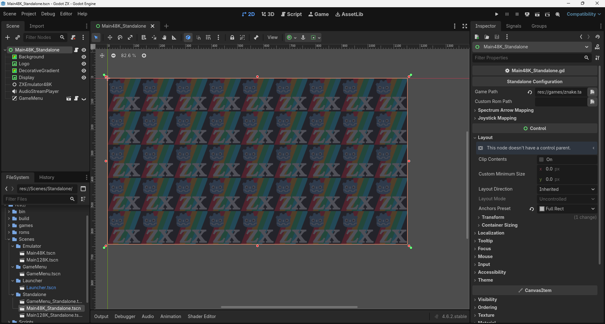

# Standalone Configuration

The Standalone version of the project is designed for distributing a single game, making it ideal for platforms like Steam where you want the executable to launch directly into a specific title.

## Changing the Game Path

To change which game the standalone version boots, follow these steps:

### Visual Overview

In the image below, you can see the Godot Editor setup for the Standalone scene:

**What you see in the image:**

1.  **Scene Tree**: The `Main48K_Standalone.tscn` (or `Main128K_Standalone.tscn`) is open.
2.  **Selected Node**: The root node (Main48K_Standalone) of the scene is selected in the Scene Tree.
3.  **Inspector**: On the right panel, under the **Standalone Configuration** category, you will find the properties exposed by the script.
4.  **Game Path**: This field contains the path to the game file (e.g., `res://games/znake.tap`).

### Step-by-Step Instructions

1.  **Open the Scene**: In the Godot FileSystem, navigate to `res://Scenes/Standalone/` and open either `Main48K_Standalone.tscn` or `Main128K_Standalone.tscn` depending on the model you want.
2.  **Select the Root Node**: Click on the top-most node in the Scene Tree (usually named the same as the scene).
3.  **Locate Standalone Configuration**: Look at the **Inspector** tab on the right side of the editor. Find the section titled **Standalone Configuration**.
4.  **Modify Game Path**:
    *   You can type the path directly into the **Game Path** field.
    *   Alternatively, click the **Folder Icon** next to the field to open a file browser and select your game file (`.tap`).
5.  **Save the Scene**: Press `Ctrl + S` (or `Cmd + S` on macOS) to save the changes.

!!! tip
    Make sure the game file you select is located within the `res://` project folder (ideally inside `res://games/`) to ensure it is correctly exported with the project.
